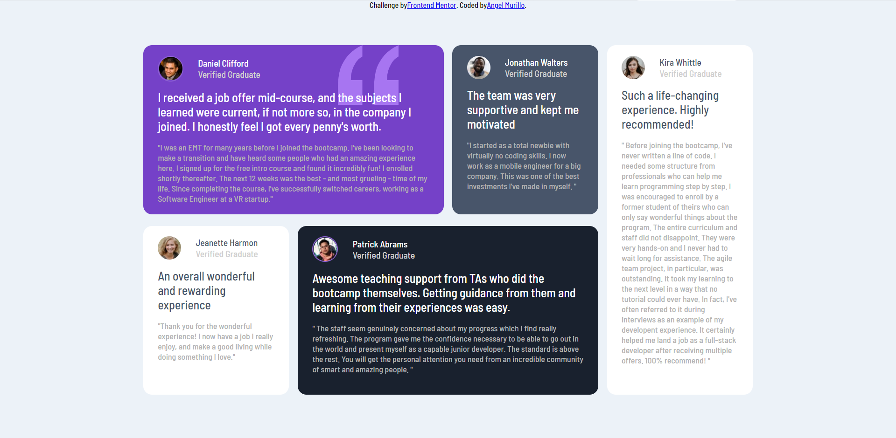

# Frontend Mentor - Testimonials grid section solution

## Table of contents

- [Overview](#overview)
  - [Screenshot](#screenshot)
  - [Links](#links)
- [My process](#my-process)
  - [Built with](#built-with)
  - [Useful resources](#useful-resources)
- [Author](#author)

## Overview

### Screenshot

### Links

- Live Site URL: [https://frontend-mentor-testimonial-beta.vercel.app/](https://frontend-mentor-testimonial-beta.vercel.app/)

## My process

### Built with

- CSS custom properties
- Flexbox
- CSS Grid
- Mobile-first workflow
- [React](https://reactjs.org/) - JS library
- [Next.js](https://nextjs.org/) - React framework
- [Styled Components](https://styled-components.com/) - For styles

### Useful resources

- [Example resource 1](https://css-tricks.com/snippets/css/complete-guide-grid/) - This guide helped me discover how to set up the css grid and modify it to meet the needs of this project.

## Author

- Frontend Mentor - [@csmurillo](https://www.frontendmentor.io/profile/csmurillo)